# Mermaid Diagrams

Create visual diagrams directly in Markdown files using Mermaid syntax. Diagrams render automatically on GitHub, in VS Code, and many other Markdown viewers.

## When to Use This Skill

- User asks to "add a diagram", "create a chart", "visualize", or "show graphically"
- Documentation needs visual representation of workflows, processes, or architecture
- Feature files or ADRs would benefit from visual diagrams
- Explaining complex logic flows, state machines, or relationships
- Creating documentation for system architecture or data models
- Visualizing timelines, schedules, or project plans

## Supported Diagram Types

| Type | Use For | Example Triggers |
|------|---------|------------------|
| **Flowchart** | Processes, decision trees, workflows | "show the flow", "decision logic" |
| **Sequence Diagram** | Interactions, API calls, message flows | "show the sequence", "API interaction" |
| **Class Diagram** | Object structures, relationships | "class structure", "data model" |
| **State Diagram** | State machines, transitions | "state transitions", "lifecycle" |
| **Entity Relationship** | Database schemas, data models | "database schema", "ER diagram" |
| **Gantt Chart** | Timelines, project schedules | "timeline", "project schedule" |
| **Pie Chart** | Proportions, distributions | "distribution", "breakdown" |
| **Git Graph** | Git branching strategies | "git workflow", "branching strategy" |
| **Mindmap** | Hierarchical concepts | "concept map", "hierarchy" |
| **Timeline** | Historical events, milestones | "history", "milestones" |
| **Quadrant Chart** | 2D categorization | "prioritization", "quadrants" |
| **User Journey** | User experiences, flows | "user flow", "journey map" |

## Creating Mermaid Diagrams

### Basic Syntax

Wrap Mermaid code in fenced code blocks with `mermaid` language identifier:

````markdown
```mermaid
<diagram-type>
  <diagram-content>
```
````

### Flowchart Example

````markdown
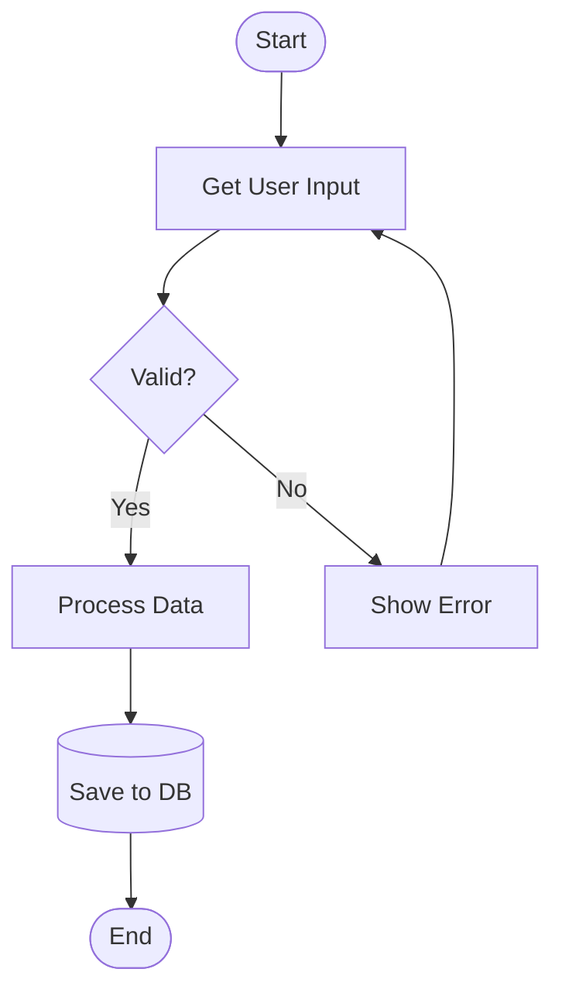
````

### Sequence Diagram Example

````markdown
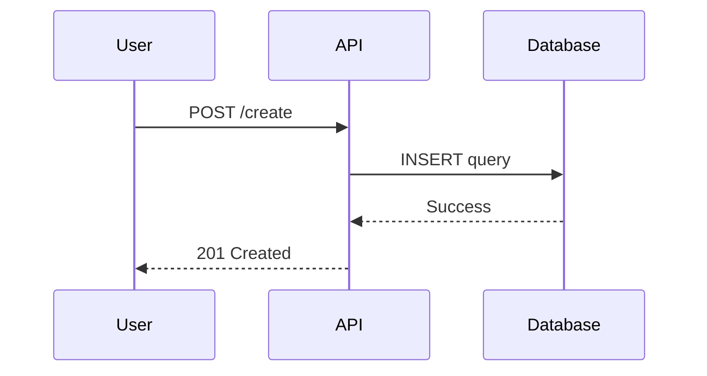
````

### Class Diagram Example

````markdown
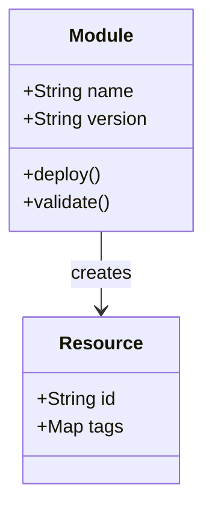
````

### State Diagram Example

````markdown
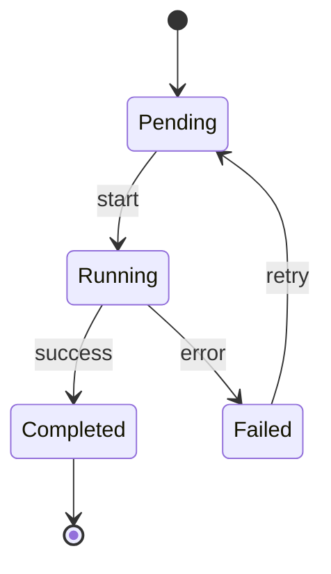
````

### Entity Relationship Diagram Example

````markdown
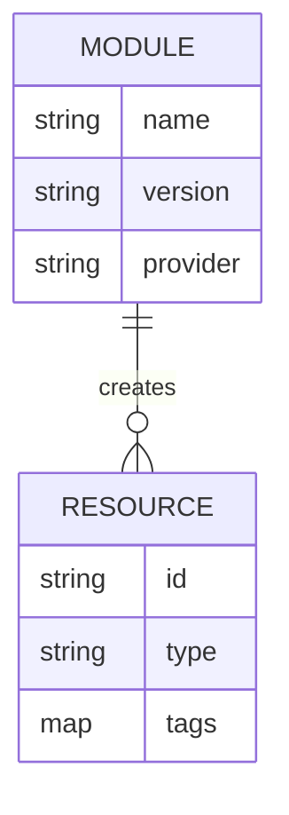
````

### Gantt Chart Example

````markdown
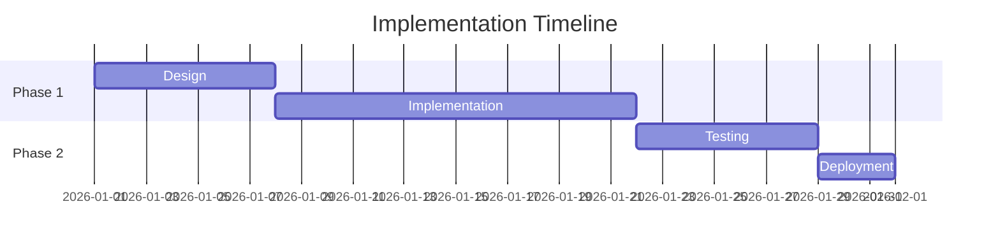
````

## Best Practices

### 1. Choose the Right Diagram Type

| Need | Recommended Type |
|------|------------------|
| Show process steps | Flowchart |
| Show interactions | Sequence Diagram |
| Show data structure | Class Diagram or ER Diagram |
| Show state changes | State Diagram |
| Show timeline | Gantt Chart or Timeline |
| Show proportions | Pie Chart |
| Show branching | Git Graph |
| Show concepts | Mindmap |

### 2. Keep Diagrams Simple

- **Limit nodes**: 10-15 nodes per diagram (split complex flows)
- **Use clear labels**: Short, descriptive text
- **Avoid clutter**: One main concept per diagram
- **Use subgraphs**: Group related elements

### 3. Use Consistent Styling

````markdown
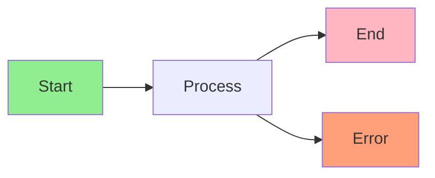
````

### 4. Add Descriptive Context

Always add explanatory text before and/or after diagrams:

````markdown
## Deployment Workflow

The following diagram shows the complete deployment process from code commit to production:

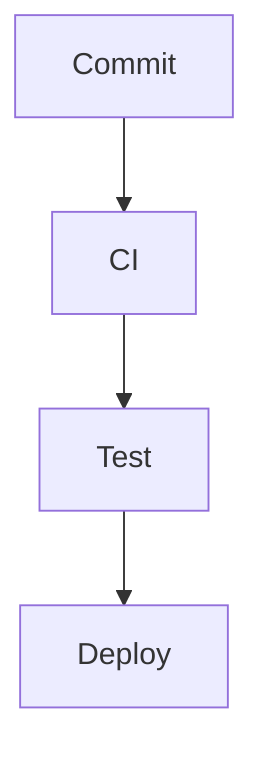

After deployment, the system automatically runs health checks and monitoring.
````

## Common Patterns

### Agent Handoff Workflow

````markdown
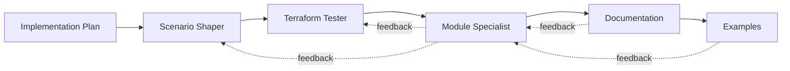
````

### TDD Workflow

````markdown
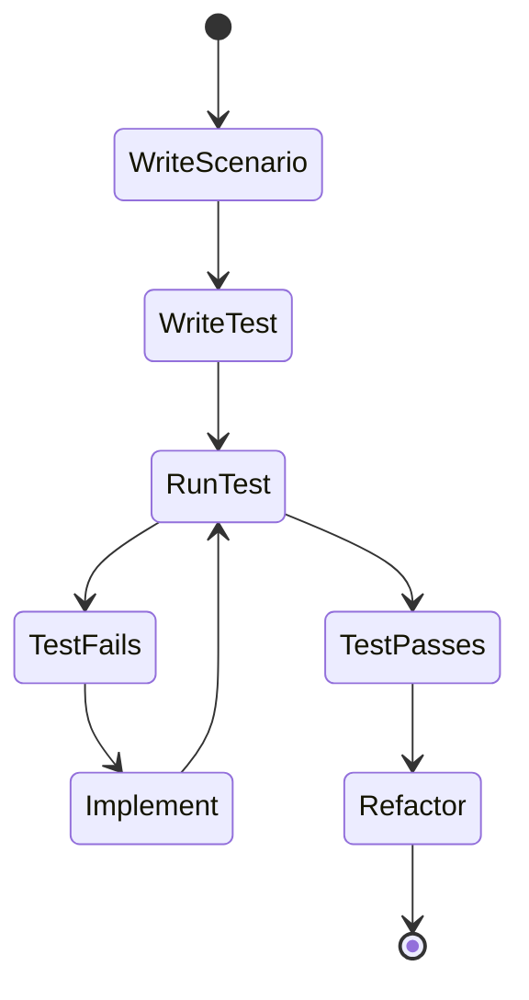
````

### Module Architecture

````markdown
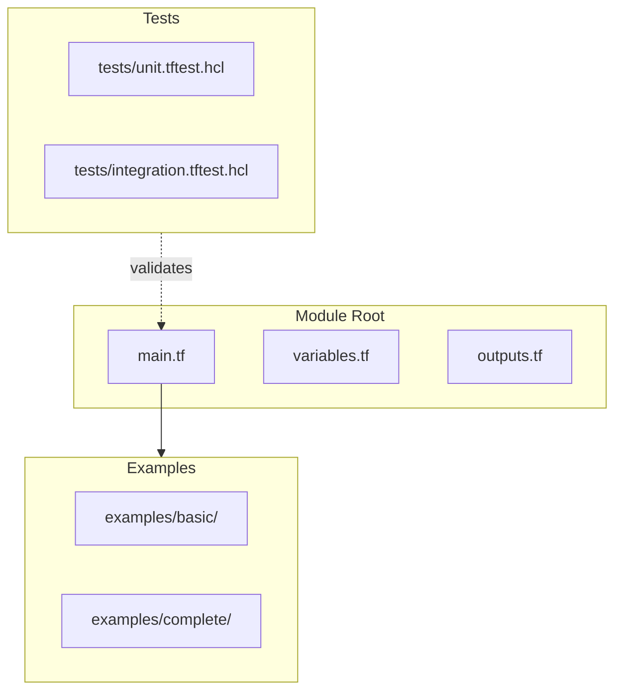
````

## Troubleshooting

| Issue | Solution |
|-------|----------|
| Diagram not rendering | Check syntax, ensure language is `mermaid` not `mmd` |
| Syntax errors | Validate at [Mermaid Live Editor](https://mermaid.live/) |
| Diagram too complex | Split into multiple smaller diagrams |
| Text overlapping | Use shorter labels or adjust direction (TD, LR, etc.) |
| Links not clickable | Use `click` syntax: `click Node "https://url"` |

## Advanced Features

### Clickable Nodes

````markdown
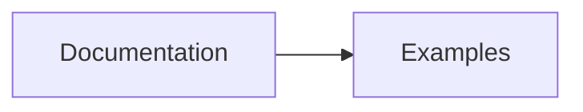
````

### Styling and Themes

````markdown
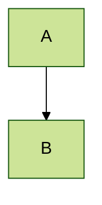
````

Available themes: `default`, `forest`, `dark`, `neutral`, `base`

### Subgraphs for Organization

````markdown
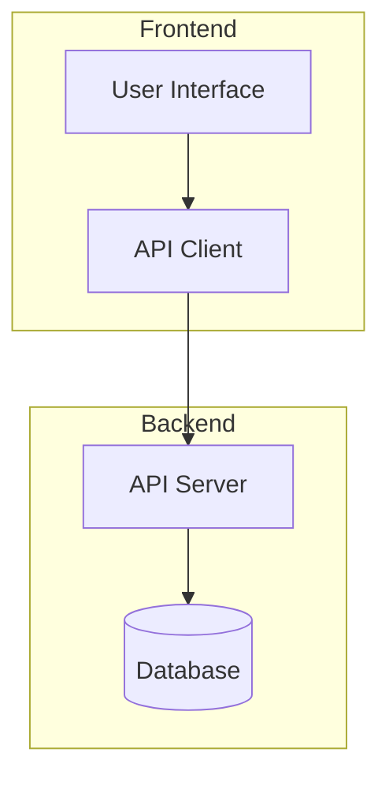
````

## References

- **Mermaid Syntax Reference**: <https://mermaid.js.org/intro/syntax-reference.html>
- **GitHub Diagrams Documentation**: <https://docs.github.com/en/get-started/writing-on-github/working-with-advanced-formatting/creating-diagrams>
- **Mermaid Live Editor**: <https://mermaid.live/> (for testing/validation)
- **Flowchart Syntax**: <https://mermaid.js.org/syntax/flowchart.html>
- **Sequence Diagram Syntax**: <https://mermaid.js.org/syntax/sequenceDiagram.html>
- **Class Diagram Syntax**: <https://mermaid.js.org/syntax/classDiagram.html>
- **State Diagram Syntax**: <https://mermaid.js.org/syntax/stateDiagram.html>
- **ER Diagram Syntax**: <https://mermaid.js.org/syntax/entityRelationshipDiagram.html>
- **Gantt Chart Syntax**: <https://mermaid.js.org/syntax/gantt.html>

## Quick Start Checklist

- [ ] Identify what needs visualization
- [ ] Choose appropriate diagram type
- [ ] Draft diagram structure (nodes, connections, flow)
- [ ] Add Mermaid code block to Markdown file
- [ ] Validate syntax at [mermaid.live](https://mermaid.live/)
- [ ] Add explanatory text around diagram
- [ ] Test rendering on GitHub/VS Code
- [ ] Refine styling and layout if needed
